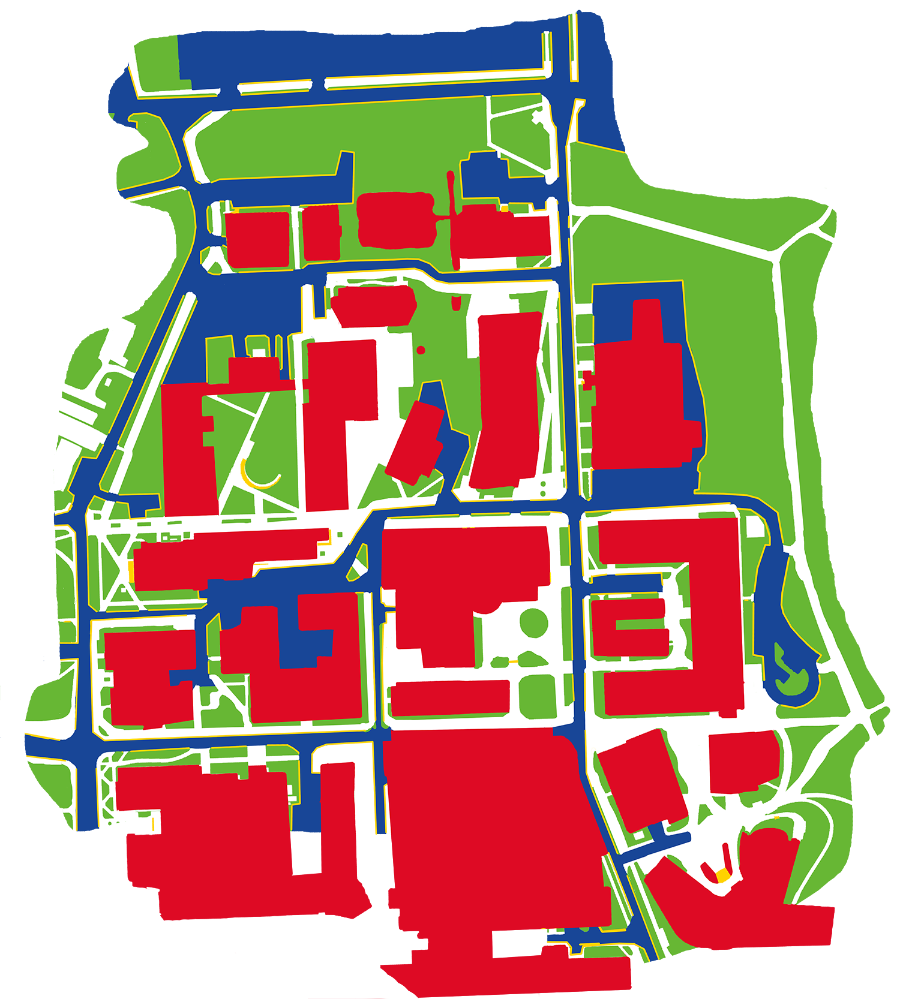

<div align="center">
  
  
  <div>&nbsp;</div>
  <div align="center">
    <b><font size="4">GND: Global Navigation Dataset with Multi-Modal Perception and Multi-Category Traversability in Outdoor Campus Environments </font></b>
    <sup>
    </sup>
    &nbsp;&nbsp;&nbsp;&nbsp;
  </div>
  <div>&nbsp;</div>

[Dataset](https://dataverse.orc.gmu.edu/dataset.xhtml?persistentId=doi:10.13021/orc2020/JUIW5F) |
[Code](https://github.com/jingGM/GND) |
[Website](https://cs.gmu.edu/~xiao/Research/GND/) |
[Video](https://www.youtube.com/watch?v=teNuzlAEDY8) |
[Paper](https://arxiv.org/abs/2409.14262)

</div>

# Citing
* > Liang, Jing*, Dibyendu Das*, Daeun Song*, Md Nahid Hasan Shuvo, Mohammad Durrani, Karthik Taranath, Ivan Penskiy, Dinesh Manocha, and Xuesu Xiao,
  > **"GND: Global Navigation Dataset with Multi-Modal Perception and Multi-Category Traversability in Outdoor Campus Environments"**,
  > in 2025 IEEE International Conference on Robotics and Automation (ICRA), 2025. ([PDF](https://arxiv.org/pdf/2409.14262v1))

        @misc{liang2024gndglobalnavigationdataset,
              title={GND: Global Navigation Dataset with Multi-Modal Perception and Multi-Category Traversability in Outdoor Campus Environments}, 
              author={\textbf{Jing Liang}* and Dibyendu Das* and Daeun Song* and Md Nahid Hasan Shuvo and Mohammad Durrani and Karthik Taranath and Ivan Penskiy and Dinesh Manocha and Xuesu Xiao},
              year={2025}, 
              booktitle={2025 IEEE International Conference on Robotics and Automation (ICRA)}, 
              organization={IEEE}
              }

# Necessary ROS Topics:
```
RGB Images:                                      /camera/camera_info; /camera/color/image_raw/compressed
360 Images:                                      /rail_robot/pano_image/compressed
IMU(best 9axis IMU, 6axis also works):           /camera/imu
Point cloud from Velodyne Lidar:                 /velodyne_points; /scan
Odometry(velocity and orientation are required): /odometry/filtered
If you have GPS sensor:                          usable GPS data. e.g. /mavros/global_position/global; /f9p_rover/navpvt;
other topics:                                    /tf;  /tf_static;
```
Pay attention to the RGB images. Sometimes if the camera is over exposured the camera's rostopic will crash and never receive images in the current bag file.

Before data collection, check the sensors' status: Camera, IMU, Lidar, Odometry and (GPS) by rviz or terminal.

Data collection matter a lot to the accuracy and drifiting of map building. Thus, it's highly recommended to try some small dataset and get a sense of how Lio-Sam works and how is the performance of the algorithm.


# Setup Environment after Data Collection
### Install [ROS Noetic](http://wiki.ros.org/noetic/Installation/Ubuntu)

### Install python environment
```
conda create -n gnd python=3.8
conda activate gnd
pip install -r requirements.txt
sudo apt-get install ros-noetic-ros-numpy
```
add to python path:
```
/opt/ros/noetic/lib/python3/dist-packages
/opt/ros/noetic/lib
```
you can directly put these two in .bashrc:
```commandline
echo "export PYTHONPATH=$PYTHONPATH:/opt/ros/noetic/lib/python3/dist-packages:/opt/ros/noetic/lib" >> ~/.bashrc
```

### Install GTSAM:
```commandline
sudo add-apt-repository ppa:borglab/gtsam-release-4.0
sudo apt update
sudo apt install libgtsam-dev libgtsam-unstable-dev
```

In "lio_sam_ws/src/SC-LIO-SAM/CMakeLists.txt", change line 10 to the conda environment
```commandline
set(CONDA_ENV_DIR "/home/USER_NAME/anaconda3/envs/gnd")
```

Build Lio-sam:
```commandline
cd lio_sam_ws
catkin_make
source devel/setup.bash
```
You can also write the source command to your bash file:
```commandline
echo "source ROOT_FOLDER/lio_sam_ws/devel/setup.bash" >> ~/.bashrc
```

# Camera-LIDAR Calibration Using Matlab's Tools
### Step 1: Camera-LIDAR Calibration
1. Calibration Guide: Follow the detailed steps in the [Matlab's Lidar Camera Calibrator Tutorial for camera-LIDAR calibration](https://www.mathworks.com/help/lidar/ug/get-started-lidar-camera-calibrator.html).
2. Camera Intrinsic Parameters: Ensure you have the intrinsic parameters of your camera. Obtain these by following the [Exporting Camera Intrinsic Parameters Tutorial](https://www.mathworks.com/help/vision/ug/using-the-single-camera-calibrator-app.html).
### Step 2: Data Collection Preparation
1. Checkered Board for Calibration: Use a standard checkered board with an even number of squares on one dimension and an odd number on the other. This is for initial camera calibration and Camera-LIDAR calibration.
2. Camera and LIDAR Setup: Connect the camera to your computer. The LIDAR can be connected to the same computer or a robot, accessible via SSH.
3. Running LIDAR Node: Start the LIDAR node to collect point clouds. Do this before running the datacollect.py script.
4. Data Collection with datacollect.py in camera_lidar_calibration folder: Execute datacollect.py to capture 20 sets of images and corresponding point clouds, with a 5-second pause between each set. These data sets are used for Camera-LIDAR calibration.

# Process Data:
### 1. Use Lio-sam to build map
- You can always refer to the [Lio-Sam](https://github.com/TixiaoShan/LIO-SAM)
- Add configuration of your robot in folder "lio_sam_ws/src/SC-LIO-SAM/config", add your own yaml file according to the current files. Modify the following parameters according to your system.
```
  pointCloudTopic: "velodyne_points"         # Point cloud data
  imuTopic: "camera/imu"                     # IMU data
  odomTopic: "odometry/imu"                  # IMU pre-preintegration odometry, same frequency as IMU
  gpsTopic: "odometry/gps"                   # GPS odometry topic from navsat, see module_navsat.launch file

  # Frames
  lidarFrame: "base_link"
  baselinkFrame: "base_link"
  odometryFrame: "odom"
  
  savePCDDirectory: "/home/USER_NAME/Documents/GND/results/ROSBAGNAME"      # in your home folder, starts and ends with "/". Warning: the code deletes "LOAM" folder then recreates it. See "mapOptimization" for implementation
  
  sensor: velodyne                            # lidar sensor type, 'velodyne' or 'ouster' or 'livox'
  N_SCAN: 16                                  # number of lidar channel (i.e., Velodyne/Ouster: 16, 32, 64, 128, Livox Horizon: 6)
  Horizon_SCAN: 1800                          # lidar horizontal resolution (Velodyne:1800, Ouster:512,1024,2048, Livox Horizon: 4000)

  extrinsicTrans: [0.0, 0.0, 0.0]
  extrinsicRot: [0, 0, 1,
                -1, 0, 0,
                 0,-1, 0]
  extrinsicRPY: [1, 0, 0,
                 0, 1, 0,
                 0, 0, 1]
```

- In the folder "lio_sam_ws/src/SC-LIO-SAM/launch", create your own launch file according to "run_husky.launch", and modify the following yaml file to your yaml (created in the last step)
```
    <rosparam file="$(find sc_liosam)/config/params_husky.yaml" command="load" />
```

- Process Rosbags: Skip this step if imu has 9 axis.
Before running the Lio-Sam, you need to make sure the IMU topic of your rosbag has 9-axis, which includes orientations. If not we provide a function to use odometry orientation as a substitution
```
python process_rosbags.py --input_rosbag="ROSBAG_DIRECTORY.bag" --output_rosbag="OUTPUT_ROSBAG_DIRECTORY.bag" --odom_topic="ODOMETRY TOPIC NAME" --imu_topic="IMU TOPIC NAME"
```

- Run Lio-Sam:
```
roslaunch sc_liosam YOUR_LAUNCH_FILE.launch
```
e.g. ```roslaunch sc_liosam run_husky.launch```

- Run rosbag:
```rosbag play xxx.bag --pause```
```--pause``` is to help you to control the bag and you can always press SPACE key in your keyboard to start/pause playing rosbag

After the rosbag stopped, press Ctrl+c once in the lio-sam terminal to stop the code and save the point clouds.
DON'T PRESS MANY TIMES OF CTRL+C

Then you will get all the points in the folder named as ROSBAGNAME that is what you set above in the yaml file:
```
savePCDDirectory: "/home/USER_NAME/Documents/GND/results/ROSBAGNAME"
```

You may need to run it several times or start at different time steps to generate a good map.


### 2. Remove ground points of each rosbag-generated results
```
python process_pcd.py --display_steps --display_remove --frame_separate=20 --folder="The result folder of the rosbag"
```
Then you will get a file "map_removed_ground_top.pcd" and "map_removed_ground_top.png". Make sure you check the png file to see if the map is good.

When displaying points, you can press "esc" button to close the display window.


### 3. Register the point clouds from different rosbags together
- Build Teaser++
```
cd teaser++
mkdir build && cd build
cmake -DTEASERPP_PYTHON_VERSION=3.10 .. && make teaserpp_python
cd python && pip install .
```

- generate registration matrices
```
# use threshold to choose the points for registration
python registration.py --src_folder="avw1" --dst_folder="iribe2" --display --src_threshold -10 10 -10 10 --dst_threshold -10 10 -10 10 --choose_type=0 --root="DATA ROOT"

# or first 12000 of each point cloud and do registration
python registration.py --src_folder="avw1" --dst_folder="iribe2" --display --choose_type=2 --root="DATA ROOT"
```
The choose_type argument is to downsample points: 0: use threshold; 1: downsample; 2: first 12000;

Check the selected points in each visualization and also the last windown is the merged point cloud. 

It make take several tries to choose correct threshold for registration

### 4. Draw traversability maps:
After register all the points together, you will get a big map. Draw the traversability map with the 5 colors:
- obstacles (buildings and trees): Red: #FF0000
- off-road terrain (traversable grass): green: #00FF00
- driveways: blue: #0000FF
- stairs or curbs: yellow: #FFFF00
- not-mapped areas: black: #000000
- fully traversable areas (sidewalks, concrete areas, ramp, and etc.): white: #FFFFFF

# Contact Information
```commandline
- Jing Liang: jingliangcgm@gmail.com
- Daeun Song: dsong26@gmu.edu
- Dibyendu Das: ddas6@gmu.edu
```


